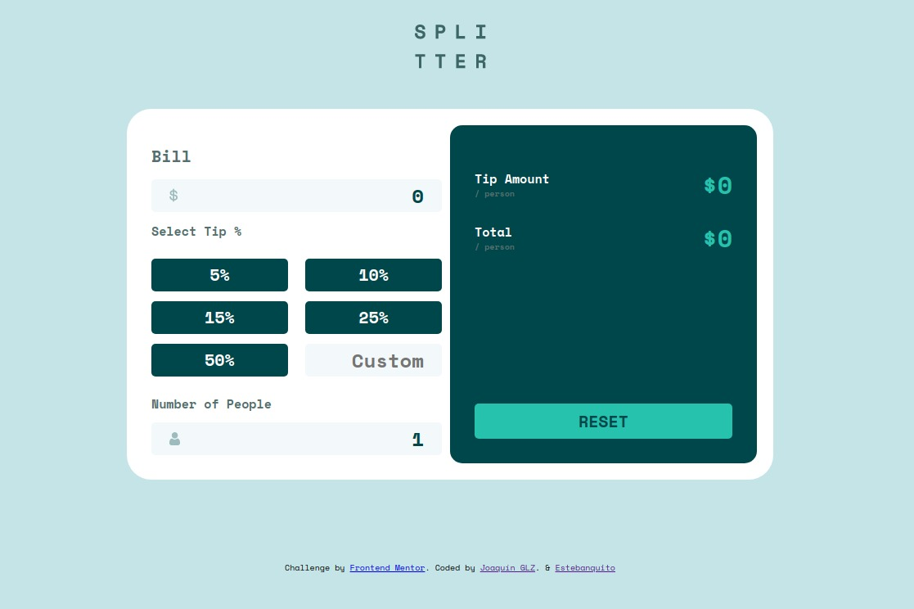

# Tip calculator 🧮

 This is a calculator for tips, you can use it whenever you need to give a tip and don't feel like calculating the amount yourself 🧐



## Built With 🔍

- HTML
- CSS
- JavaScript
- Webpack

## Live page: 📄

[Here]()

## Authors: 👋

👤 **Joaquin Garrido Lecca Zanetti**

- GitHub: [@Kakalanp](https://github.com/Kakalanp)
- Twitter: [@LeccaJoaquin](https://twitter.com/LeccaJoaquin)
- LinkedIn: [Joaquin Garrido Lecca Zanetti](https://www.linkedin.com/in/joaquín-garrido-lecca-zanetti-623583204)

👤 **Esteban Muñoz**

- GitHub: [@estebanmual](https://github.com/estebanmual)
- Twitter: [@estebanmual](https://twitter.com/estebanmual)
- LinkedIn: [Edgar Esteban Muñoz Alba](https://www.linkedin.com/in/estebanmual/)

## Contributing: 🤝

Contributions, issues, and feature requests are welcome!

Feel free to check the [issues page](../../issues/).

## Show your support: 🌟

Give a ⭐️ if you like this project!

## Getting Started: ✨

To get a local copy up and running follow these simple steps.

### Prerequisites: 🤓

- npm (node package manager)
- Have git correctly installed.

### Setup: ⚙️

- Open a terminal window where you want to have installed a copy of the repository.

- Use this command to get a copy:
```
git clone https://github.com/Kakalanp/TO-DO-list.git
```

- then, run `npm install` in your comand prompt, this will install all the listed dependencies on the package.json file.

### Usage: 🎉

- Edit the content as you like.

## Acknowledgments: 📝

- Thanks to [Frontend Mentor](https://www.frontendmentor.io/) for this [project's](https://www.frontendmentor.io/challenges/tip-calculator-app-ugJNGbJUX) assets and guidelines.
